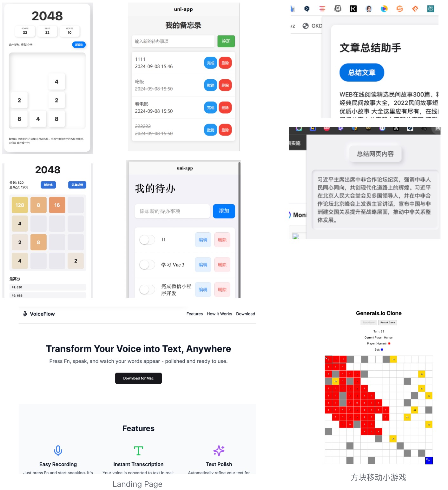

# Cursor+语音编程一日开发挑战

2024-09-08 跟【周周黑客松】的小伙伴一起做 【Cursor+语音编程一日开发挑战】，我们做了5个很简单的小项目：网页小游戏，Chrome插件，小程序，LandingPage + 一个自由项目，非常好玩！！参与的伙伴部分只有一点编程基础，可以见我们的飞书文档，有详细的教程跟实现的效果：https://hackathonweekly.feishu.cn/wiki/MtmOwfqLpibJ0ZklRO2c0NbTnZb

## 效果展示

## 其中部分部署到了 vercel 
> 其他的懒得弄了哈哈

* 2048 小游戏
https://2048-umber-theta.vercel.app/

* Landing Page （非实际产品）
https://voiceflow-landingpage.vercel.app/
